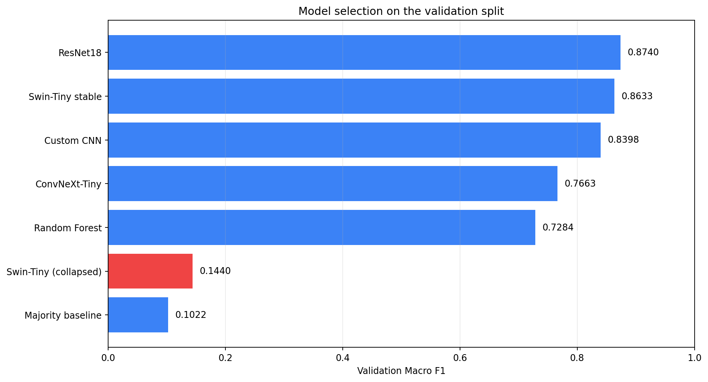
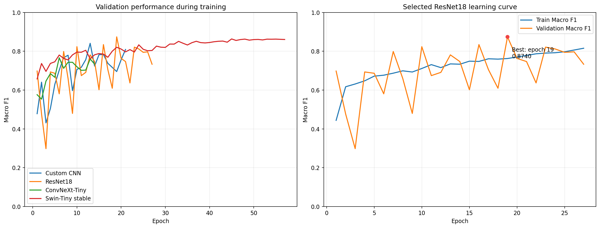
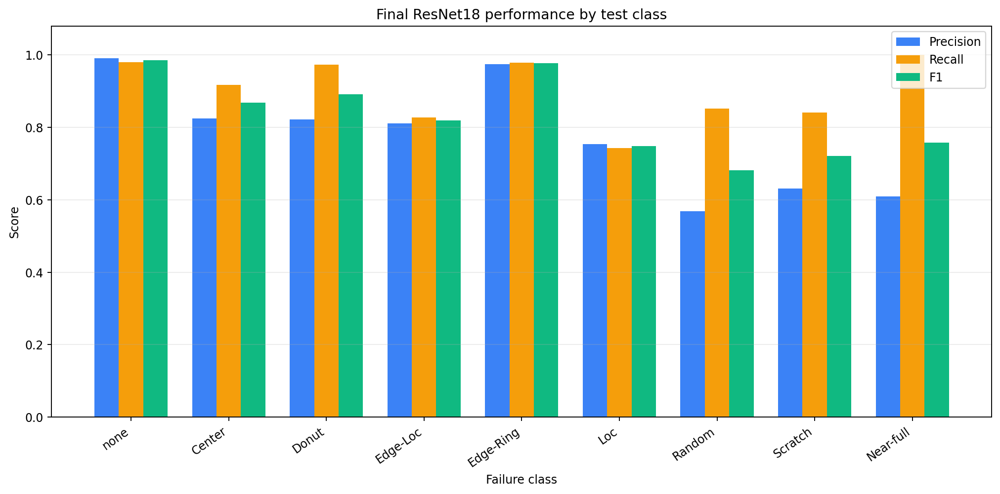
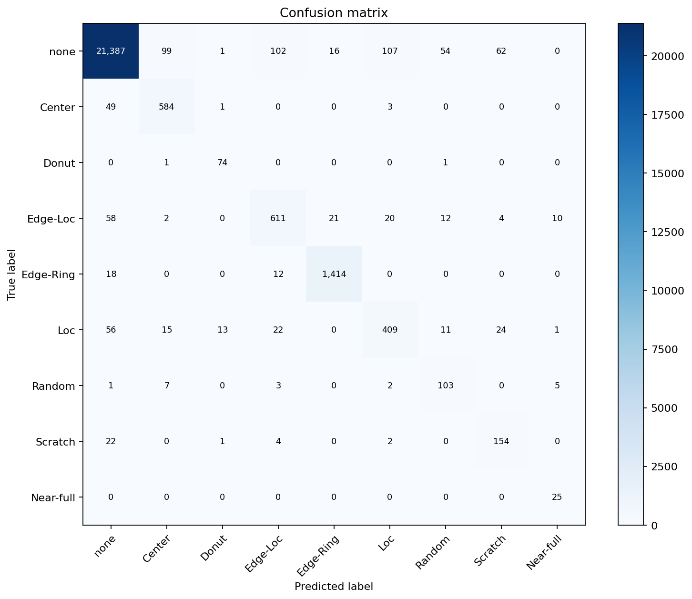
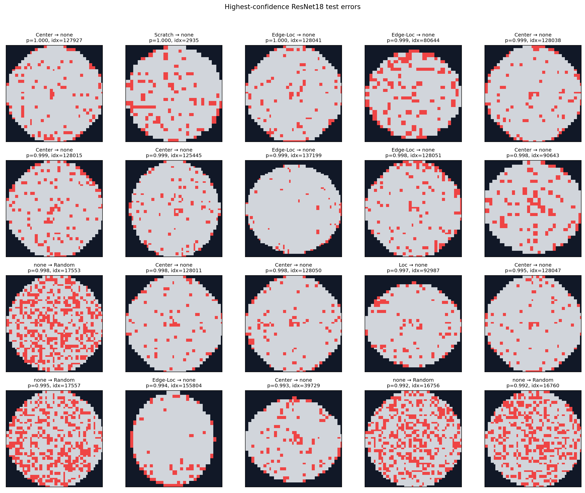
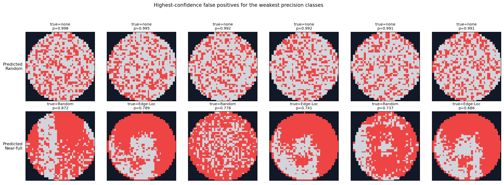
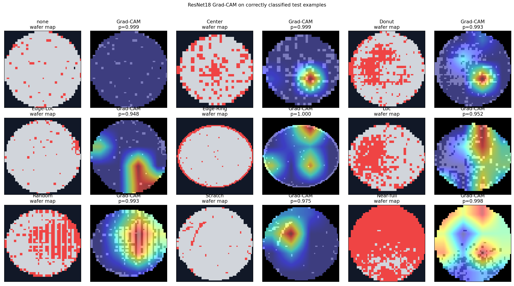

# WM-811K Final Experiment Report

## Experimental protocol

The project uses a fixed 70/15/15 split grouped by `lotName`, preventing wafers from the same
production lot from appearing in multiple splits. Model selection used validation Macro F1 only.
After selecting ResNet18, the test split was evaluated once and then frozen.

## Model selection

| Model | Validation Macro F1 | Validation balanced accuracy | Parameters |
|---|---:|---:|---:|
| ResNet18 | 0.8740 | 0.9117 | 11,177,993 |
| Swin-Tiny stable | 0.8633 | 0.8764 | 27,524,739 |
| Custom CNN | 0.8398 | 0.8479 | 316,489 |
| ConvNeXt-Tiny | 0.7663 | 0.8199 | 27,825,513 |
| Random Forest | 0.7284 | 0.6825 | N/A |
| Swin-Tiny (collapsed) | 0.1440 | 0.3027 | 27,524,739 |
| Majority baseline | 0.1022 | 0.1111 | N/A |

ResNet18 was selected with validation Macro F1 `0.8740`. The original Swin-Tiny run is retained as
an optimization-collapse case study; its stabilized BF16 run reached `0.8633`.

## Frozen test result

- Macro F1: **0.8277**
- Balanced accuracy: **0.9014**
- Accuracy: **0.9671**
- Weighted F1: **0.9681**
- Errors: **842 / 25,603**

| Class | Precision | Recall | F1 | Support |
|---|---:|---:|---:|---:|
| none | 0.991 | 0.980 | 0.985 | 21828 |
| Center | 0.825 | 0.917 | 0.868 | 637 |
| Donut | 0.822 | 0.974 | 0.892 | 76 |
| Edge-Loc | 0.810 | 0.828 | 0.819 | 738 |
| Edge-Ring | 0.975 | 0.979 | 0.977 | 1444 |
| Loc | 0.753 | 0.742 | 0.748 | 551 |
| Random | 0.569 | 0.851 | 0.682 | 121 |
| Scratch | 0.631 | 0.842 | 0.721 | 183 |
| Near-full | 0.610 | 1.000 | 0.758 | 25 |

## Error analysis

The main Macro-F1 reduction from validation (`0.8740`) to test (`0.8277`)
comes from precision on the small Random and Near-full classes. Their recall remains high, but
class-weighted training produces false positives. Scratch generalizes better on test than on
validation, while common spatial patterns such as Edge-Ring remain stable.

- Mean confidence on errors: `0.715`
- Errors with confidence >= 0.9: `171`
- Lot with most errors: `lot15619`
  (`20` errors)

| True class | Predicted class | Count |
|---|---|---:|
| none | Loc | 107 |
| none | Edge-Loc | 102 |
| none | Center | 99 |
| none | Scratch | 62 |
| Edge-Loc | none | 58 |
| Loc | none | 56 |
| none | Random | 54 |
| Center | none | 49 |

## Explainability

Grad-CAM is applied after model selection for descriptive analysis only. It should highlight the
spatial regions used by ResNet18, but it is not a causal explanation and was not used to tune the
model.

## Limitations

- WM-811K is severely imbalanced; Near-full has only 25 test examples.
- `none` means no assigned failure pattern, not necessarily zero failed dies.
- Maps are padded and resized to 64x64, which can remove fine die-level detail.
- Results come from one fixed lot-aware split and have no external-fab validation.
- The test set has been consumed and must not be used for further model selection.
